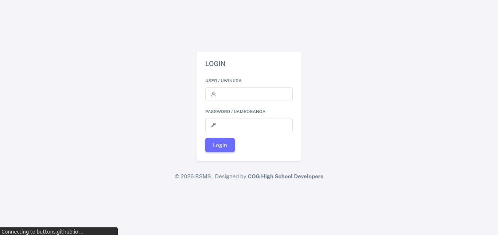

# Boutique Shop Management System (BSMS)

Boutique Shop Management System is a lightweight, responsive PHP and MySQL web application designed to handle boutique inventory, client records, stock transactions (stock-in / stock-out), debts tracking, and visual analytics reports.

---

## 📸 Application Screenshots

### 1. Modern Login Portal
Bilingual authentication panel supporting dual-language login modes (English & Kinyarwanda).


### 2. Manager Panel Dashboard
Visualizes shop management metrics and provides quick shortcuts for managing products, adding sales, and tracking client debts.


### 3. Product Catalog View
A tabular overview displaying products, quality tiers, and manufacturers.


### 4. Inventory Stock Ledger
Manages stock-in details, purchase values, unit cost pricing, expected retail incomes, and batch expiration tracking.


### 5. Custom Sales Range Report
Generates total revenue, sales aggregates, and net profit margins between any two selected dates.


### 6. Multi-Language Support (Kinyarwanda Translation)
Full localization capability supporting both English and Kinyarwanda dialects dynamically mapped to user settings.


---

## 🛠️ Technology Stack

*   **Language**: PHP (v8.1 compatible)
*   **Database**: MySQL v8.0 / MariaDB
*   **Front-End**: Bootstrap 5, Sass, Unicons Icon pack
*   **Web Server**: Apache HTTP Server

---

## 📁 Project Structure

```
Shop-Management-System-BSMS-/
├── assets/                    # Static UI elements (images, vendor libraries)
├── database/                  # MySQL schema definition dumps
│   └── bsms.sql               # Database setup and test records
├── html/                      # Core PHP panels and view routers
│   ├── dailyreport.php        # Daily transactions aggregates
│   ├── monthlyreport.php      # Monthly sales breakdowns
│   ├── rangereport.php        # custom from-to dates calculations
│   ├── index.php              # Dashboard analytics panel
│   └── forms/                 # Form templates for adding items
├── includes/                  # Connection handlers and menu layouts
│   ├── connect.php            # Primary DB connector
│   └── navbar.php             # Global navigation bar
├── index.php                  # Login routing entrypoint
├── Dockerfile                 # Apache/PHP build settings
└── docker-compose.yml         # Container coordination settings
```

---

## 🐳 Running with Docker Compose

You can deploy the entire shop management application—including the relational database and the pre-configured Apache PHP web server—automatically inside Docker containers.

### Setup and Start:
1. Ensure **Docker** and **Docker Compose** are installed and running.
2. From the project root directory, launch the build:
   ```bash
   docker compose up --build -d
   ```
3. This command will automatically:
   * Build the Apache PHP container and enable URL rewrite libraries.
   * Spawn a MySQL 8 database container.
   * **Seed Database**: The database initialization scripts will run automatically to load `database/bsms.sql` containing schemas and test user credentials.
4. Browse the application locally at **`http://localhost`**.

### Shut down the system:
```bash
docker compose down -v
```

---

## 🚀 How to Run the Project (Manually)

If you prefer to run the application outside of Docker, follow these manual setup steps.

### 📋 Prerequisites
*   **PHP** (v8.1 or newer recommended)
*   **MySQL Server**
*   **Apache HTTP Server** (or PHP built-in server)

### Step 1: Database Initialization
1. Start your local MySQL server.
2. Create a new database named `bsms`.
3. Import the database schema from `/database/bsms.sql`:
   ```bash
   mysql -u root -p bsms < database/bsms.sql
   ```

### Step 2: Connection Configuration
1. Open both [connect.php](file:///data/projects/other/Shop-Management-System-BSMS-/connect.php) and [includes/connect.php](file:///data/projects/other/Shop-Management-System-BSMS-/includes/connect.php).
2. Adjust the connection parameters if you are not using default root settings:
   ```php
   $host = 'localhost';
   $user = 'your_username';
   $pass = 'your_password';
   $db   = 'bsms';
   ```

### Step 3: Run the Web Server
1. If using PHP's built-in server, start it from the root directory:
   ```bash
   php -S localhost:8000
   ```
2. Open your browser and navigate to `http://localhost:8000`.

---

## 🔑 Default Login Credentials

Once the system builds and seeds the database, you can log in using either of the following roles:

### 1. Manager (Administrator) Profile
*   **User Type**: Select `manager` from the dropdown
*   **Password**: `123`

### 2. Seller Profile
*   **User Type**: Select `seller` from the dropdown
*   **Password**: `321`
